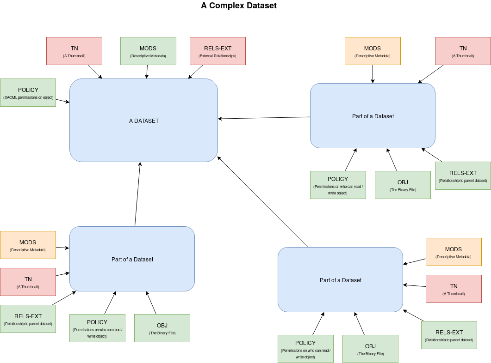

======================
Dataset from Islandora
======================

-----
About
-----

All datasets in Trace are currently held in an instance of `Islandora <https://trace.utk.edu>`_. A metadata-only record is
also available in `Digital Commons <https://trace.tennessee.edu>`_.  This document describes the objects to be migrated.

----------
Data Model
----------

This image describes a dataset and all its bitstreams.  In our current repository, the dataset and its individual parts
are separate objects. This is represented by the shapes in blue above.  In the migration, bitstreams in green are
considered important and bitstreams in red are not.  Reasoning for this is covered in greater detail below:

The Parent Object
=================

Each dataset is represented by a simple object with descriptive metadata, a thumbnail, a XACML policy that describes who
can access the parent object, and an external relationship file. We deem the following bitstreams to be pertinent to the
migration:

* MODS (the descriptive metadata)
* POLICY (the access policy)

The descriptive metadata here describes the entire
object and is thus essential for migration. The external relationships file (RELS-EXT) has no value since it only
describes the entire datasets relationship to the overall repository (not the individual parts).

Descriptive Metadata (MODS)
---------------------------

This is a sample descriptive metadata record for an existing dataset.

.. code-block:: xml

    <?xml version="1.0" encoding="UTF-8"?>
    <mods:mods xmlns:mods="http://www.loc.gov/mods/v3" xmlns="http://www.loc.gov/mods/v3" xmlns:etd="http://www.ndltd.org/standards/metadata/etdms/1.0" xmlns:xsi="http://www.w3.org/2001/XMLSchema-instance" xmlns:xlink="http://www.w3.org/1999/xlink" xmlns:xs="http://www.w3.org/2001/XMLSchema" xsi:schemaLocation="http://www.loc.gov/mods/v3 http://www.loc.gov/standards/mods/v3/mods-3-5.xsd" version="3.5">
        <mods:titleInfo>
            <mods:title>Data from NSF Award #1155339: Governance of International Labor Migration: Scalar Politics and Network Relations</mods:title>
        </mods:titleInfo>
        <mods:name valueURI="">
            <mods:namePart type="given">Micheline</mods:namePart>
            <mods:namePart type="family">van Riemsijk</mods:namePart>
            <mods:role>
                <mods:roleTerm authority="marcrelator" type="text" valueURI="http://id.loc.gov/vocabulary/relators/dpt">Depositor</mods:roleTerm>
            </mods:role>
            <mods:affiliation/>
            <mods:affiliation/>
            <mods:affiliation/>
            <mods:affiliation/>
        </mods:name>
        <mods:name>
            <mods:namePart type="given">Micheline</mods:namePart>
            <mods:role>
                <mods:roleTerm authority="marcrelator" type="text" valueURI="http://id.loc.gov/vocabulary/relators/cre">Creator</mods:roleTerm>
            </mods:role>
            <mods:namePart type="family">van Riemsdijk</mods:namePart>
            <mods:namePart type="termsOfAddress"/>
        </mods:name>
        <mods:subject>
            <mods:topic>skilled migration</mods:topic>
        </mods:subject>
        <mods:physicalDescription>
            <mods:form authority="coar" valueURI="http://purl.org/coar/resource_type/c_ddb1">dataset</mods:form>
        </mods:physicalDescription>
        <mods:typeOfResource>software, multimedia</mods:typeOfResource>
        <mods:recordInfo>
            <mods:recordContentSource authority="isni" valueURI="http://www.isni.org/isni/0000000123151184">University of Tennessee (Knoxville)</mods:recordContentSource>
            <mods:languageOfCataloging>
                <mods:languageTerm type="code" authority="iso639-2b">eng</mods:languageTerm>
            </mods:languageOfCataloging>
            <mods:recordOrigin>Created and edited in general conformance to MODS Guidelines (Version 3.5).</mods:recordOrigin>
        </mods:recordInfo>
        <mods:relatedItem type="series">
            <mods:titleInfo>
                <mods:title>Faculty and Graduate Student Research and Creative Work</mods:title>
            </mods:titleInfo>
        </mods:relatedItem>
        <mods:relatedItem displayLabel="Funder">
            <mods:titleInfo type="alternative">
                <mods:title>National Science Foundation (all directorates)</mods:title>
                <mods:subTitle/>
            </mods:titleInfo>
            <mods:identifier>1155339</mods:identifier>
        </mods:relatedItem>
        <mods:identifier type="doi">http://dx.doi.org/10.7290/V7X63JT6</mods:identifier>
        <mods:note type="preferred citation"/>
        <mods:abstract>The deposited documents are created for a project funded by the National Science Foundation on the governance of international labor migration: politics of scale and networks (Award #1155339). The site contains transcripts of interviews with stakeholders in international skilled migration, a survey conducted with foreign-born engineers and information technology specialists in two petroleum-related companies and two information technology companies, survey codes, a project web site, research presentations, and a project-related publication.</mods:abstract>
        <mods:subject>
            <mods:topic>immigration</mods:topic>
        </mods:subject>
        <mods:subject>
            <mods:topic>Norway</mods:topic>
        </mods:subject>
        <mods:subject>
            <mods:topic>Oslo</mods:topic>
        </mods:subject>
        <mods:subject>
            <mods:topic>Kongsberg</mods:topic>
        </mods:subject>
        <mods:subject>
            <mods:topic>Stavanger</mods:topic>
        </mods:subject>
        <mods:subject>
            <mods:topic>oil and gas industry</mods:topic>
        </mods:subject>
        <mods:subject>
            <mods:topic>petroleum industry</mods:topic>
        </mods:subject>
        <mods:subject>
            <mods:topic>engineering</mods:topic>
        </mods:subject>
        <mods:subject>
            <mods:topic>information technology</mods:topic>
        </mods:subject>
        <mods:subject>
            <mods:topic>scale</mods:topic>
        </mods:subject>
        <mods:subject>
            <mods:topic>network</mods:topic>
        </mods:subject>
        <mods:typeOfResource>software, multimedia</mods:typeOfResource>
        <mods:recordInfo>
            <mods:recordContentSource authority="isni" valueURI="http://www.isni.org/isni/0000000123151184">University of Tennessee (Knoxville)</mods:recordContentSource>
            <mods:languageOfCataloging>
                <mods:languageTerm type="code" authority="iso639-2b">eng</mods:languageTerm>
            </mods:languageOfCataloging>
            <mods:recordOrigin>Created and edited in general conformance to MODS Guidelines (Version 3.5).</mods:recordOrigin>
        </mods:recordInfo>
        <mods:relatedItem type="series">
            <mods:titleInfo>
                <mods:title>Faculty and Graduate Student Research and Creative Work</mods:title>
            </mods:titleInfo>
        </mods:relatedItem>
    </mods:mods>

Access Policy (Policy)
----------------------

This is a sample access policy for an object that is accessible by anyone.

.. code-block:: xml

    <?xml version="1.0" encoding="UTF-8"?>
    <Policy xmlns="urn:oasis:names:tc:xacml:1.0:policy" xmlns:xsi="http://www.w3.org/2001/XMLSchema-instance" PolicyId="islandora-xacml-editor-v1" RuleCombiningAlgId="urn:oasis:names:tc:xacml:1.0:rule-combining-algorithm:first-applicable">
      <Target>
        <Subjects>
          <AnySubject/>
        </Subjects>
        <Resources>
          <AnyResource/>
        </Resources>
        <Actions>
          <AnyAction/>
        </Actions>
      </Target>
      <Rule RuleId="deny-management-functions" Effect="Deny">
        <Target>
          <Subjects>
            <AnySubject/>
          </Subjects>
          <Resources>
            <AnyResource/>
          </Resources>
          <Actions>
            <Action>
              <ActionMatch MatchId="urn:oasis:names:tc:xacml:1.0:function:string-equal">
                <AttributeValue DataType="http://www.w3.org/2001/XMLSchema#string">urn:fedora:names:fedora:2.1:action:id-addDatastream</AttributeValue>
                <ActionAttributeDesignator AttributeId="urn:fedora:names:fedora:2.1:action:id" DataType="http://www.w3.org/2001/XMLSchema#string"/>
              </ActionMatch>
            </Action>
            <Action>
              <ActionMatch MatchId="urn:oasis:names:tc:xacml:1.0:function:string-equal">
                <AttributeValue DataType="http://www.w3.org/2001/XMLSchema#string">urn:fedora:names:fedora:2.1:action:id-addDisseminator</AttributeValue>
                <ActionAttributeDesignator AttributeId="urn:fedora:names:fedora:2.1:action:id" DataType="http://www.w3.org/2001/XMLSchema#string"/>
              </ActionMatch>
            </Action>
            <Action>
              <ActionMatch MatchId="urn:oasis:names:tc:xacml:1.0:function:string-equal">
                <AttributeValue DataType="http://www.w3.org/2001/XMLSchema#string">urn:fedora:names:fedora:2.1:action:id-adminPing</AttributeValue>
                <ActionAttributeDesignator AttributeId="urn:fedora:names:fedora:2.1:action:id" DataType="http://www.w3.org/2001/XMLSchema#string"/>
              </ActionMatch>
            </Action>
            <Action>
              <ActionMatch MatchId="urn:oasis:names:tc:xacml:1.0:function:string-equal">
                <AttributeValue DataType="http://www.w3.org/2001/XMLSchema#string">urn:fedora:names:fedora:2.1:action:id-getDisseminatorHistory</AttributeValue>
                <ActionAttributeDesignator AttributeId="urn:fedora:names:fedora:2.1:action:id" DataType="http://www.w3.org/2001/XMLSchema#string"/>
              </ActionMatch>
            </Action>
            <Action>
              <ActionMatch MatchId="urn:oasis:names:tc:xacml:1.0:function:string-equal">
                <AttributeValue DataType="http://www.w3.org/2001/XMLSchema#string">urn:fedora:names:fedora:2.1:action:id-getNextPid</AttributeValue>
                <ActionAttributeDesignator AttributeId="urn:fedora:names:fedora:2.1:action:id" DataType="http://www.w3.org/2001/XMLSchema#string"/>
              </ActionMatch>
            </Action>
            <Action>
              <ActionMatch MatchId="urn:oasis:names:tc:xacml:1.0:function:string-equal">
                <AttributeValue DataType="http://www.w3.org/2001/XMLSchema#string">urn:fedora:names:fedora:2.1:action:id-ingest</AttributeValue>
                <ActionAttributeDesignator AttributeId="urn:fedora:names:fedora:2.1:action:id" DataType="http://www.w3.org/2001/XMLSchema#string"/>
              </ActionMatch>
            </Action>
            <Action>
              <ActionMatch MatchId="urn:oasis:names:tc:xacml:1.0:function:string-equal">
                <AttributeValue DataType="http://www.w3.org/2001/XMLSchema#string">urn:fedora:names:fedora:2.1:action:id-modifyDatastreamByReference</AttributeValue>
                <ActionAttributeDesignator AttributeId="urn:fedora:names:fedora:2.1:action:id" DataType="http://www.w3.org/2001/XMLSchema#string"/>
              </ActionMatch>
            </Action>
            <Action>
              <ActionMatch MatchId="urn:oasis:names:tc:xacml:1.0:function:string-equal">
                <AttributeValue DataType="http://www.w3.org/2001/XMLSchema#string">urn:fedora:names:fedora:2.1:action:id-modifyDatastreamByValue</AttributeValue>
                <ActionAttributeDesignator AttributeId="urn:fedora:names:fedora:2.1:action:id" DataType="http://www.w3.org/2001/XMLSchema#string"/>
              </ActionMatch>
            </Action>
            <Action>
              <ActionMatch MatchId="urn:oasis:names:tc:xacml:1.0:function:string-equal">
                <AttributeValue DataType="http://www.w3.org/2001/XMLSchema#string">urn:fedora:names:fedora:2.1:action:id-modifyDisseminator</AttributeValue>
                <ActionAttributeDesignator AttributeId="urn:fedora:names:fedora:2.1:action:id" DataType="http://www.w3.org/2001/XMLSchema#string"/>
              </ActionMatch>
            </Action>
            <Action>
              <ActionMatch MatchId="urn:oasis:names:tc:xacml:1.0:function:string-equal">
                <AttributeValue DataType="http://www.w3.org/2001/XMLSchema#string">urn:fedora:names:fedora:2.1:action:id-modifyObject</AttributeValue>
                <ActionAttributeDesignator AttributeId="urn:fedora:names:fedora:2.1:action:id" DataType="http://www.w3.org/2001/XMLSchema#string"/>
              </ActionMatch>
            </Action>
            <Action>
              <ActionMatch MatchId="urn:oasis:names:tc:xacml:1.0:function:string-equal">
                <AttributeValue DataType="http://www.w3.org/2001/XMLSchema#string">urn:fedora:names:fedora:2.1:action:id-purgeObject</AttributeValue>
                <ActionAttributeDesignator AttributeId="urn:fedora:names:fedora:2.1:action:id" DataType="http://www.w3.org/2001/XMLSchema#string"/>
              </ActionMatch>
            </Action>
            <Action>
              <ActionMatch MatchId="urn:oasis:names:tc:xacml:1.0:function:string-equal">
                <AttributeValue DataType="http://www.w3.org/2001/XMLSchema#string">urn:fedora:names:fedora:2.1:action:id-purgeDatastream</AttributeValue>
                <ActionAttributeDesignator AttributeId="urn:fedora:names:fedora:2.1:action:id" DataType="http://www.w3.org/2001/XMLSchema#string"/>
              </ActionMatch>
            </Action>
            <Action>
              <ActionMatch MatchId="urn:oasis:names:tc:xacml:1.0:function:string-equal">
                <AttributeValue DataType="http://www.w3.org/2001/XMLSchema#string">urn:fedora:names:fedora:2.1:action:id-purgeDisseminator</AttributeValue>
                <ActionAttributeDesignator AttributeId="urn:fedora:names:fedora:2.1:action:id" DataType="http://www.w3.org/2001/XMLSchema#string"/>
              </ActionMatch>
            </Action>
            <Action>
              <ActionMatch MatchId="urn:oasis:names:tc:xacml:1.0:function:string-equal">
                <AttributeValue DataType="http://www.w3.org/2001/XMLSchema#string">urn:fedora:names:fedora:2.1:action:id-setDatastreamState</AttributeValue>
                <ActionAttributeDesignator AttributeId="urn:fedora:names:fedora:2.1:action:id" DataType="http://www.w3.org/2001/XMLSchema#string"/>
              </ActionMatch>
            </Action>
            <Action>
              <ActionMatch MatchId="urn:oasis:names:tc:xacml:1.0:function:string-equal">
                <AttributeValue DataType="http://www.w3.org/2001/XMLSchema#string">urn:fedora:names:fedora:2.1:action:id-setDisseminatorState</AttributeValue>
                <ActionAttributeDesignator AttributeId="urn:fedora:names:fedora:2.1:action:id" DataType="http://www.w3.org/2001/XMLSchema#string"/>
              </ActionMatch>
            </Action>
            <Action>
              <ActionMatch MatchId="urn:oasis:names:tc:xacml:1.0:function:string-equal">
                <AttributeValue DataType="http://www.w3.org/2001/XMLSchema#string">urn:fedora:names:fedora:2.1:action:id-setDatastreamVersionable</AttributeValue>
                <ActionAttributeDesignator AttributeId="urn:fedora:names:fedora:2.1:action:id" DataType="http://www.w3.org/2001/XMLSchema#string"/>
              </ActionMatch>
            </Action>
            <Action>
              <ActionMatch MatchId="urn:oasis:names:tc:xacml:1.0:function:string-equal">
                <AttributeValue DataType="http://www.w3.org/2001/XMLSchema#string">urn:fedora:names:fedora:2.1:action:id-compareDatastreamChecksum</AttributeValue>
                <ActionAttributeDesignator AttributeId="urn:fedora:names:fedora:2.1:action:id" DataType="http://www.w3.org/2001/XMLSchema#string"/>
              </ActionMatch>
            </Action>
            <Action>
              <ActionMatch MatchId="urn:oasis:names:tc:xacml:1.0:function:string-equal">
                <AttributeValue DataType="http://www.w3.org/2001/XMLSchema#string">urn:fedora:names:fedora:2.1:action:id-serverShutdown</AttributeValue>
                <ActionAttributeDesignator AttributeId="urn:fedora:names:fedora:2.1:action:id" DataType="http://www.w3.org/2001/XMLSchema#string"/>
              </ActionMatch>
            </Action>
            <Action>
              <ActionMatch MatchId="urn:oasis:names:tc:xacml:1.0:function:string-equal">
                <AttributeValue DataType="http://www.w3.org/2001/XMLSchema#string">urn:fedora:names:fedora:2.1:action:id-serverStatus</AttributeValue>
                <ActionAttributeDesignator AttributeId="urn:fedora:names:fedora:2.1:action:id" DataType="http://www.w3.org/2001/XMLSchema#string"/>
              </ActionMatch>
            </Action>
            <Action>
              <ActionMatch MatchId="urn:oasis:names:tc:xacml:1.0:function:string-equal">
                <AttributeValue DataType="http://www.w3.org/2001/XMLSchema#string">urn:fedora:names:fedora:2.1:action:id-upload</AttributeValue>
                <ActionAttributeDesignator AttributeId="urn:fedora:names:fedora:2.1:action:id" DataType="http://www.w3.org/2001/XMLSchema#string"/>
              </ActionMatch>
            </Action>
            <Action>
              <ActionMatch MatchId="urn:oasis:names:tc:xacml:1.0:function:string-equal">
                <AttributeValue DataType="http://www.w3.org/2001/XMLSchema#string">urn:fedora:names:fedora:2.1:action:id-dsstate</AttributeValue>
                <ActionAttributeDesignator AttributeId="urn:fedora:names:fedora:2.1:action:id" DataType="http://www.w3.org/2001/XMLSchema#string"/>
              </ActionMatch>
            </Action>
            <Action>
              <ActionMatch MatchId="urn:oasis:names:tc:xacml:1.0:function:string-equal">
                <AttributeValue DataType="http://www.w3.org/2001/XMLSchema#string">urn:fedora:names:fedora:2.1:action:id-resolveDatastream</AttributeValue>
                <ActionAttributeDesignator AttributeId="urn:fedora:names:fedora:2.1:action:id" DataType="http://www.w3.org/2001/XMLSchema#string"/>
              </ActionMatch>
            </Action>
            <Action>
              <ActionMatch MatchId="urn:oasis:names:tc:xacml:1.0:function:string-equal">
                <AttributeValue DataType="http://www.w3.org/2001/XMLSchema#string">urn:fedora:names:fedora:2.1:action:id-reloadPolicies</AttributeValue>
                <ActionAttributeDesignator AttributeId="urn:fedora:names:fedora:2.1:action:id" DataType="http://www.w3.org/2001/XMLSchema#string"/>
              </ActionMatch>
            </Action>
          </Actions>
        </Target>
        <Condition FunctionId="urn:oasis:names:tc:xacml:1.0:function:not">
          <Apply FunctionId="urn:oasis:names:tc:xacml:1.0:function:or">
            <Apply FunctionId="urn:oasis:names:tc:xacml:1.0:function:string-at-least-one-member-of">
              <SubjectAttributeDesignator DataType="http://www.w3.org/2001/XMLSchema#string" MustBePresent="false" AttributeId="urn:fedora:names:fedora:2.1:subject:loginId"/>
              <Apply FunctionId="urn:oasis:names:tc:xacml:1.0:function:string-bag">
                <AttributeValue DataType="http://www.w3.org/2001/XMLSchema#string">admin</AttributeValue>
                <AttributeValue DataType="http://www.w3.org/2001/XMLSchema#string">fedoraAdmin</AttributeValue>
              </Apply>
            </Apply>
            <Apply FunctionId="urn:oasis:names:tc:xacml:1.0:function:string-at-least-one-member-of">
              <SubjectAttributeDesignator DataType="http://www.w3.org/2001/XMLSchema#string" MustBePresent="false" AttributeId="fedoraRole"/>
              <Apply FunctionId="urn:oasis:names:tc:xacml:1.0:function:string-bag">
                <AttributeValue DataType="http://www.w3.org/2001/XMLSchema#string">administrator</AttributeValue>
                <AttributeValue DataType="http://www.w3.org/2001/XMLSchema#string">dataset_manager_role</AttributeValue>
                <AttributeValue DataType="http://www.w3.org/2001/XMLSchema#string">manager-role</AttributeValue>
              </Apply>
            </Apply>
          </Apply>
        </Condition>
      </Rule>
      <Rule RuleId="allow-everything-else" Effect="Permit">
        <Target>
          <Subjects>
            <AnySubject/>
          </Subjects>
          <Resources>
            <AnyResource/>
          </Resources>
          <Actions>
            <AnyAction/>
          </Actions>
        </Target>
      </Rule>
    </Policy>

Relationships File (RELS-EXT)
-----------------------------

As you can see in this example, there is no way to understand the relationship between a dataset and its parts by
reviewing its relationships file.

.. code-block:: xml

    <rdf:RDF xmlns:fedora="info:fedora/fedora-system:def/relations-external#" xmlns:fedora-model="info:fedora/fedora-system:def/model#" xmlns:islandora="http://islandora.ca/ontology/relsext#" xmlns:rdf="http://www.w3.org/1999/02/22-rdf-syntax-ns#">
      <rdf:Description rdf:about="info:fedora/utk.ir.fg:29">
        <fedora:isMemberOfCollection rdf:resource="info:fedora/utk.ir:fg"></fedora:isMemberOfCollection>
        <fedora-model:hasModel rdf:resource="info:fedora/islandora:compoundCModel"></fedora-model:hasModel>
        <islandora:isManageableByUser>admin</islandora:isManageableByUser>
        <islandora:isManageableByUser>comyn7</islandora:isManageableByUser>
        <islandora:isManageableByUser>fedoraAdmin</islandora:isManageableByUser>
        <islandora:isManageableByRole>administrator</islandora:isManageableByRole>
        <islandora:isManageableByRole>dataset_manager_role</islandora:isManageableByRole>
        <islandora:isManageableByRole>manager-role</islandora:isManageableByRole>
      </rdf:Description>
    </rdf:RDF>

-------------------
A Part of a Dataset
-------------------

Each file in a dataset has it's own bitstreams that are important for the migration.  These pieces are covered below:

Individual Bitstreams (OBJ)
---------------------------

The binary file for each part is available in a bitstream called OBJ.  This is the exact object that was uploaded into
the repository.

Relationships (RELS-EXT)
------------------------

The RELS-EXT file describes the bitstreams relationship to it's parent dataset as well as other parts of the repository.

.. code-block:: xml
    :emphasize-lines: 11-12

    <rdf:RDF xmlns:fedora="info:fedora/fedora-system:def/relations-external#" xmlns:fedora-model="info:fedora/fedora-system:def/model#" xmlns:islandora="http://islandora.ca/ontology/relsext#" xmlns:rdf="http://www.w3.org/1999/02/22-rdf-syntax-ns#">
      <rdf:Description rdf:about="info:fedora/utk.ir.fg:31">
        <fedora:isMemberOfCollection rdf:resource="info:fedora/utk.ir:fg"></fedora:isMemberOfCollection>
        <fedora-model:hasModel rdf:resource="info:fedora/islandora:binaryObjectCModel"></fedora-model:hasModel>
        <islandora:isManageableByUser>admin</islandora:isManageableByUser>
        <islandora:isManageableByUser>mbagget1</islandora:isManageableByUser>
        <islandora:isManageableByUser>fedoraAdmin</islandora:isManageableByUser>
        <islandora:isManageableByRole>administrator</islandora:isManageableByRole>
        <islandora:isManageableByRole>dataset_manager_role</islandora:isManageableByRole>
        <islandora:isManageableByRole>manager-role</islandora:isManageableByRole>
        <fedora:isConstituentOf rdf:resource="info:fedora/utk.ir.fg:29"></fedora:isConstituentOf>
        <islandora:isSequenceNumberOfutk.ir.fg_29>1</islandora:isSequenceNumberOfutk.ir.fg_29>
      </rdf:Description>
    </rdf:RDF>

Access Restrictions (POLICY)
----------------------------

The piece of each dataset has an access policy that describes whether the object is available to all or just admins,
the dataset manager, and its owner.

This bitstream is available to all:

.. code-block:: xml

    <?xml version="1.0" encoding="UTF-8"?>
    <Policy xmlns="urn:oasis:names:tc:xacml:1.0:policy" xmlns:xsi="http://www.w3.org/2001/XMLSchema-instance" PolicyId="islandora-xacml-editor-v1" RuleCombiningAlgId="urn:oasis:names:tc:xacml:1.0:rule-combining-algorithm:first-applicable">
      <Target>
        <Subjects>
          <AnySubject/>
        </Subjects>
        <Resources>
          <AnyResource/>
        </Resources>
        <Actions>
          <AnyAction/>
        </Actions>
      </Target>
      <Rule RuleId="deny-management-functions" Effect="Deny">
        <Target>
          <Subjects>
            <AnySubject/>
          </Subjects>
          <Resources>
            <AnyResource/>
          </Resources>
          <Actions>
            <Action>
              <ActionMatch MatchId="urn:oasis:names:tc:xacml:1.0:function:string-equal">
                <AttributeValue DataType="http://www.w3.org/2001/XMLSchema#string">urn:fedora:names:fedora:2.1:action:id-addDatastream</AttributeValue>
                <ActionAttributeDesignator AttributeId="urn:fedora:names:fedora:2.1:action:id" DataType="http://www.w3.org/2001/XMLSchema#string"/>
              </ActionMatch>
            </Action>
            <Action>
              <ActionMatch MatchId="urn:oasis:names:tc:xacml:1.0:function:string-equal">
                <AttributeValue DataType="http://www.w3.org/2001/XMLSchema#string">urn:fedora:names:fedora:2.1:action:id-addDisseminator</AttributeValue>
                <ActionAttributeDesignator AttributeId="urn:fedora:names:fedora:2.1:action:id" DataType="http://www.w3.org/2001/XMLSchema#string"/>
              </ActionMatch>
            </Action>
            <Action>
              <ActionMatch MatchId="urn:oasis:names:tc:xacml:1.0:function:string-equal">
                <AttributeValue DataType="http://www.w3.org/2001/XMLSchema#string">urn:fedora:names:fedora:2.1:action:id-adminPing</AttributeValue>
                <ActionAttributeDesignator AttributeId="urn:fedora:names:fedora:2.1:action:id" DataType="http://www.w3.org/2001/XMLSchema#string"/>
              </ActionMatch>
            </Action>
            <Action>
              <ActionMatch MatchId="urn:oasis:names:tc:xacml:1.0:function:string-equal">
                <AttributeValue DataType="http://www.w3.org/2001/XMLSchema#string">urn:fedora:names:fedora:2.1:action:id-getDisseminatorHistory</AttributeValue>
                <ActionAttributeDesignator AttributeId="urn:fedora:names:fedora:2.1:action:id" DataType="http://www.w3.org/2001/XMLSchema#string"/>
              </ActionMatch>
            </Action>
            <Action>
              <ActionMatch MatchId="urn:oasis:names:tc:xacml:1.0:function:string-equal">
                <AttributeValue DataType="http://www.w3.org/2001/XMLSchema#string">urn:fedora:names:fedora:2.1:action:id-getNextPid</AttributeValue>
                <ActionAttributeDesignator AttributeId="urn:fedora:names:fedora:2.1:action:id" DataType="http://www.w3.org/2001/XMLSchema#string"/>
              </ActionMatch>
            </Action>
            <Action>
              <ActionMatch MatchId="urn:oasis:names:tc:xacml:1.0:function:string-equal">
                <AttributeValue DataType="http://www.w3.org/2001/XMLSchema#string">urn:fedora:names:fedora:2.1:action:id-ingest</AttributeValue>
                <ActionAttributeDesignator AttributeId="urn:fedora:names:fedora:2.1:action:id" DataType="http://www.w3.org/2001/XMLSchema#string"/>
              </ActionMatch>
            </Action>
            <Action>
              <ActionMatch MatchId="urn:oasis:names:tc:xacml:1.0:function:string-equal">
                <AttributeValue DataType="http://www.w3.org/2001/XMLSchema#string">urn:fedora:names:fedora:2.1:action:id-modifyDatastreamByReference</AttributeValue>
                <ActionAttributeDesignator AttributeId="urn:fedora:names:fedora:2.1:action:id" DataType="http://www.w3.org/2001/XMLSchema#string"/>
              </ActionMatch>
            </Action>
            <Action>
              <ActionMatch MatchId="urn:oasis:names:tc:xacml:1.0:function:string-equal">
                <AttributeValue DataType="http://www.w3.org/2001/XMLSchema#string">urn:fedora:names:fedora:2.1:action:id-modifyDatastreamByValue</AttributeValue>
                <ActionAttributeDesignator AttributeId="urn:fedora:names:fedora:2.1:action:id" DataType="http://www.w3.org/2001/XMLSchema#string"/>
              </ActionMatch>
            </Action>
            <Action>
              <ActionMatch MatchId="urn:oasis:names:tc:xacml:1.0:function:string-equal">
                <AttributeValue DataType="http://www.w3.org/2001/XMLSchema#string">urn:fedora:names:fedora:2.1:action:id-modifyDisseminator</AttributeValue>
                <ActionAttributeDesignator AttributeId="urn:fedora:names:fedora:2.1:action:id" DataType="http://www.w3.org/2001/XMLSchema#string"/>
              </ActionMatch>
            </Action>
            <Action>
              <ActionMatch MatchId="urn:oasis:names:tc:xacml:1.0:function:string-equal">
                <AttributeValue DataType="http://www.w3.org/2001/XMLSchema#string">urn:fedora:names:fedora:2.1:action:id-modifyObject</AttributeValue>
                <ActionAttributeDesignator AttributeId="urn:fedora:names:fedora:2.1:action:id" DataType="http://www.w3.org/2001/XMLSchema#string"/>
              </ActionMatch>
            </Action>
            <Action>
              <ActionMatch MatchId="urn:oasis:names:tc:xacml:1.0:function:string-equal">
                <AttributeValue DataType="http://www.w3.org/2001/XMLSchema#string">urn:fedora:names:fedora:2.1:action:id-purgeObject</AttributeValue>
                <ActionAttributeDesignator AttributeId="urn:fedora:names:fedora:2.1:action:id" DataType="http://www.w3.org/2001/XMLSchema#string"/>
              </ActionMatch>
            </Action>
            <Action>
              <ActionMatch MatchId="urn:oasis:names:tc:xacml:1.0:function:string-equal">
                <AttributeValue DataType="http://www.w3.org/2001/XMLSchema#string">urn:fedora:names:fedora:2.1:action:id-purgeDatastream</AttributeValue>
                <ActionAttributeDesignator AttributeId="urn:fedora:names:fedora:2.1:action:id" DataType="http://www.w3.org/2001/XMLSchema#string"/>
              </ActionMatch>
            </Action>
            <Action>
              <ActionMatch MatchId="urn:oasis:names:tc:xacml:1.0:function:string-equal">
                <AttributeValue DataType="http://www.w3.org/2001/XMLSchema#string">urn:fedora:names:fedora:2.1:action:id-purgeDisseminator</AttributeValue>
                <ActionAttributeDesignator AttributeId="urn:fedora:names:fedora:2.1:action:id" DataType="http://www.w3.org/2001/XMLSchema#string"/>
              </ActionMatch>
            </Action>
            <Action>
              <ActionMatch MatchId="urn:oasis:names:tc:xacml:1.0:function:string-equal">
                <AttributeValue DataType="http://www.w3.org/2001/XMLSchema#string">urn:fedora:names:fedora:2.1:action:id-setDatastreamState</AttributeValue>
                <ActionAttributeDesignator AttributeId="urn:fedora:names:fedora:2.1:action:id" DataType="http://www.w3.org/2001/XMLSchema#string"/>
              </ActionMatch>
            </Action>
            <Action>
              <ActionMatch MatchId="urn:oasis:names:tc:xacml:1.0:function:string-equal">
                <AttributeValue DataType="http://www.w3.org/2001/XMLSchema#string">urn:fedora:names:fedora:2.1:action:id-setDisseminatorState</AttributeValue>
                <ActionAttributeDesignator AttributeId="urn:fedora:names:fedora:2.1:action:id" DataType="http://www.w3.org/2001/XMLSchema#string"/>
              </ActionMatch>
            </Action>
            <Action>
              <ActionMatch MatchId="urn:oasis:names:tc:xacml:1.0:function:string-equal">
                <AttributeValue DataType="http://www.w3.org/2001/XMLSchema#string">urn:fedora:names:fedora:2.1:action:id-setDatastreamVersionable</AttributeValue>
                <ActionAttributeDesignator AttributeId="urn:fedora:names:fedora:2.1:action:id" DataType="http://www.w3.org/2001/XMLSchema#string"/>
              </ActionMatch>
            </Action>
            <Action>
              <ActionMatch MatchId="urn:oasis:names:tc:xacml:1.0:function:string-equal">
                <AttributeValue DataType="http://www.w3.org/2001/XMLSchema#string">urn:fedora:names:fedora:2.1:action:id-compareDatastreamChecksum</AttributeValue>
                <ActionAttributeDesignator AttributeId="urn:fedora:names:fedora:2.1:action:id" DataType="http://www.w3.org/2001/XMLSchema#string"/>
              </ActionMatch>
            </Action>
            <Action>
              <ActionMatch MatchId="urn:oasis:names:tc:xacml:1.0:function:string-equal">
                <AttributeValue DataType="http://www.w3.org/2001/XMLSchema#string">urn:fedora:names:fedora:2.1:action:id-serverShutdown</AttributeValue>
                <ActionAttributeDesignator AttributeId="urn:fedora:names:fedora:2.1:action:id" DataType="http://www.w3.org/2001/XMLSchema#string"/>
              </ActionMatch>
            </Action>
            <Action>
              <ActionMatch MatchId="urn:oasis:names:tc:xacml:1.0:function:string-equal">
                <AttributeValue DataType="http://www.w3.org/2001/XMLSchema#string">urn:fedora:names:fedora:2.1:action:id-serverStatus</AttributeValue>
                <ActionAttributeDesignator AttributeId="urn:fedora:names:fedora:2.1:action:id" DataType="http://www.w3.org/2001/XMLSchema#string"/>
              </ActionMatch>
            </Action>
            <Action>
              <ActionMatch MatchId="urn:oasis:names:tc:xacml:1.0:function:string-equal">
                <AttributeValue DataType="http://www.w3.org/2001/XMLSchema#string">urn:fedora:names:fedora:2.1:action:id-upload</AttributeValue>
                <ActionAttributeDesignator AttributeId="urn:fedora:names:fedora:2.1:action:id" DataType="http://www.w3.org/2001/XMLSchema#string"/>
              </ActionMatch>
            </Action>
            <Action>
              <ActionMatch MatchId="urn:oasis:names:tc:xacml:1.0:function:string-equal">
                <AttributeValue DataType="http://www.w3.org/2001/XMLSchema#string">urn:fedora:names:fedora:2.1:action:id-dsstate</AttributeValue>
                <ActionAttributeDesignator AttributeId="urn:fedora:names:fedora:2.1:action:id" DataType="http://www.w3.org/2001/XMLSchema#string"/>
              </ActionMatch>
            </Action>
            <Action>
              <ActionMatch MatchId="urn:oasis:names:tc:xacml:1.0:function:string-equal">
                <AttributeValue DataType="http://www.w3.org/2001/XMLSchema#string">urn:fedora:names:fedora:2.1:action:id-resolveDatastream</AttributeValue>
                <ActionAttributeDesignator AttributeId="urn:fedora:names:fedora:2.1:action:id" DataType="http://www.w3.org/2001/XMLSchema#string"/>
              </ActionMatch>
            </Action>
            <Action>
              <ActionMatch MatchId="urn:oasis:names:tc:xacml:1.0:function:string-equal">
                <AttributeValue DataType="http://www.w3.org/2001/XMLSchema#string">urn:fedora:names:fedora:2.1:action:id-reloadPolicies</AttributeValue>
                <ActionAttributeDesignator AttributeId="urn:fedora:names:fedora:2.1:action:id" DataType="http://www.w3.org/2001/XMLSchema#string"/>
              </ActionMatch>
            </Action>
          </Actions>
        </Target>
        <Condition FunctionId="urn:oasis:names:tc:xacml:1.0:function:not">
          <Apply FunctionId="urn:oasis:names:tc:xacml:1.0:function:or">
            <Apply FunctionId="urn:oasis:names:tc:xacml:1.0:function:string-at-least-one-member-of">
              <SubjectAttributeDesignator DataType="http://www.w3.org/2001/XMLSchema#string" MustBePresent="false" AttributeId="urn:fedora:names:fedora:2.1:subject:loginId"/>
              <Apply FunctionId="urn:oasis:names:tc:xacml:1.0:function:string-bag">
                <AttributeValue DataType="http://www.w3.org/2001/XMLSchema#string">admin</AttributeValue>
                <AttributeValue DataType="http://www.w3.org/2001/XMLSchema#string">fedoraAdmin</AttributeValue>
              </Apply>
            </Apply>
            <Apply FunctionId="urn:oasis:names:tc:xacml:1.0:function:string-at-least-one-member-of">
              <SubjectAttributeDesignator DataType="http://www.w3.org/2001/XMLSchema#string" MustBePresent="false" AttributeId="fedoraRole"/>
              <Apply FunctionId="urn:oasis:names:tc:xacml:1.0:function:string-bag">
                <AttributeValue DataType="http://www.w3.org/2001/XMLSchema#string">administrator</AttributeValue>
                <AttributeValue DataType="http://www.w3.org/2001/XMLSchema#string">dataset_manager_role</AttributeValue>
                <AttributeValue DataType="http://www.w3.org/2001/XMLSchema#string">manager-role</AttributeValue>
              </Apply>
            </Apply>
          </Apply>
        </Condition>
      </Rule>
      <Rule RuleId="allow-everything-else" Effect="Permit">
        <Target>
          <Subjects>
            <AnySubject/>
          </Subjects>
          <Resources>
            <AnyResource/>
          </Resources>
          <Actions>
            <AnyAction/>
          </Actions>
        </Target>
      </Rule>
    </Policy>

This bitstream has restrictions that limit its access to repository administrators, the dataset manager, and its owner:

.. code-block:: xml

    <?xml version="1.0" encoding="UTF-8"?>
    <Policy xmlns="urn:oasis:names:tc:xacml:1.0:policy" xmlns:xsi="http://www.w3.org/2001/XMLSchema-instance" PolicyId="islandora-xacml-editor-v1" RuleCombiningAlgId="urn:oasis:names:tc:xacml:1.0:rule-combining-algorithm:first-applicable">
      <Target>
        <Subjects>
          <AnySubject/>
        </Subjects>
        <Resources>
          <AnyResource/>
        </Resources>
        <Actions>
          <AnyAction/>
        </Actions>
      </Target>
      <Rule RuleId="deny-management-functions" Effect="Deny">
        <Target>
          <Subjects>
            <AnySubject/>
          </Subjects>
          <Resources>
            <AnyResource/>
          </Resources>
          <Actions>
            <Action>
              <ActionMatch MatchId="urn:oasis:names:tc:xacml:1.0:function:string-equal">
                <AttributeValue DataType="http://www.w3.org/2001/XMLSchema#string">urn:fedora:names:fedora:2.1:action:id-addDatastream</AttributeValue>
                <ActionAttributeDesignator AttributeId="urn:fedora:names:fedora:2.1:action:id" DataType="http://www.w3.org/2001/XMLSchema#string"/>
              </ActionMatch>
            </Action>
            <Action>
              <ActionMatch MatchId="urn:oasis:names:tc:xacml:1.0:function:string-equal">
                <AttributeValue DataType="http://www.w3.org/2001/XMLSchema#string">urn:fedora:names:fedora:2.1:action:id-addDisseminator</AttributeValue>
                <ActionAttributeDesignator AttributeId="urn:fedora:names:fedora:2.1:action:id" DataType="http://www.w3.org/2001/XMLSchema#string"/>
              </ActionMatch>
            </Action>
            <Action>
              <ActionMatch MatchId="urn:oasis:names:tc:xacml:1.0:function:string-equal">
                <AttributeValue DataType="http://www.w3.org/2001/XMLSchema#string">urn:fedora:names:fedora:2.1:action:id-adminPing</AttributeValue>
                <ActionAttributeDesignator AttributeId="urn:fedora:names:fedora:2.1:action:id" DataType="http://www.w3.org/2001/XMLSchema#string"/>
              </ActionMatch>
            </Action>
            <Action>
              <ActionMatch MatchId="urn:oasis:names:tc:xacml:1.0:function:string-equal">
                <AttributeValue DataType="http://www.w3.org/2001/XMLSchema#string">urn:fedora:names:fedora:2.1:action:id-getDisseminatorHistory</AttributeValue>
                <ActionAttributeDesignator AttributeId="urn:fedora:names:fedora:2.1:action:id" DataType="http://www.w3.org/2001/XMLSchema#string"/>
              </ActionMatch>
            </Action>
            <Action>
              <ActionMatch MatchId="urn:oasis:names:tc:xacml:1.0:function:string-equal">
                <AttributeValue DataType="http://www.w3.org/2001/XMLSchema#string">urn:fedora:names:fedora:2.1:action:id-getNextPid</AttributeValue>
                <ActionAttributeDesignator AttributeId="urn:fedora:names:fedora:2.1:action:id" DataType="http://www.w3.org/2001/XMLSchema#string"/>
              </ActionMatch>
            </Action>
            <Action>
              <ActionMatch MatchId="urn:oasis:names:tc:xacml:1.0:function:string-equal">
                <AttributeValue DataType="http://www.w3.org/2001/XMLSchema#string">urn:fedora:names:fedora:2.1:action:id-ingest</AttributeValue>
                <ActionAttributeDesignator AttributeId="urn:fedora:names:fedora:2.1:action:id" DataType="http://www.w3.org/2001/XMLSchema#string"/>
              </ActionMatch>
            </Action>
            <Action>
              <ActionMatch MatchId="urn:oasis:names:tc:xacml:1.0:function:string-equal">
                <AttributeValue DataType="http://www.w3.org/2001/XMLSchema#string">urn:fedora:names:fedora:2.1:action:id-modifyDatastreamByReference</AttributeValue>
                <ActionAttributeDesignator AttributeId="urn:fedora:names:fedora:2.1:action:id" DataType="http://www.w3.org/2001/XMLSchema#string"/>
              </ActionMatch>
            </Action>
            <Action>
              <ActionMatch MatchId="urn:oasis:names:tc:xacml:1.0:function:string-equal">
                <AttributeValue DataType="http://www.w3.org/2001/XMLSchema#string">urn:fedora:names:fedora:2.1:action:id-modifyDatastreamByValue</AttributeValue>
                <ActionAttributeDesignator AttributeId="urn:fedora:names:fedora:2.1:action:id" DataType="http://www.w3.org/2001/XMLSchema#string"/>
              </ActionMatch>
            </Action>
            <Action>
              <ActionMatch MatchId="urn:oasis:names:tc:xacml:1.0:function:string-equal">
                <AttributeValue DataType="http://www.w3.org/2001/XMLSchema#string">urn:fedora:names:fedora:2.1:action:id-modifyDisseminator</AttributeValue>
                <ActionAttributeDesignator AttributeId="urn:fedora:names:fedora:2.1:action:id" DataType="http://www.w3.org/2001/XMLSchema#string"/>
              </ActionMatch>
            </Action>
            <Action>
              <ActionMatch MatchId="urn:oasis:names:tc:xacml:1.0:function:string-equal">
                <AttributeValue DataType="http://www.w3.org/2001/XMLSchema#string">urn:fedora:names:fedora:2.1:action:id-modifyObject</AttributeValue>
                <ActionAttributeDesignator AttributeId="urn:fedora:names:fedora:2.1:action:id" DataType="http://www.w3.org/2001/XMLSchema#string"/>
              </ActionMatch>
            </Action>
            <Action>
              <ActionMatch MatchId="urn:oasis:names:tc:xacml:1.0:function:string-equal">
                <AttributeValue DataType="http://www.w3.org/2001/XMLSchema#string">urn:fedora:names:fedora:2.1:action:id-purgeObject</AttributeValue>
                <ActionAttributeDesignator AttributeId="urn:fedora:names:fedora:2.1:action:id" DataType="http://www.w3.org/2001/XMLSchema#string"/>
              </ActionMatch>
            </Action>
            <Action>
              <ActionMatch MatchId="urn:oasis:names:tc:xacml:1.0:function:string-equal">
                <AttributeValue DataType="http://www.w3.org/2001/XMLSchema#string">urn:fedora:names:fedora:2.1:action:id-purgeDatastream</AttributeValue>
                <ActionAttributeDesignator AttributeId="urn:fedora:names:fedora:2.1:action:id" DataType="http://www.w3.org/2001/XMLSchema#string"/>
              </ActionMatch>
            </Action>
            <Action>
              <ActionMatch MatchId="urn:oasis:names:tc:xacml:1.0:function:string-equal">
                <AttributeValue DataType="http://www.w3.org/2001/XMLSchema#string">urn:fedora:names:fedora:2.1:action:id-purgeDisseminator</AttributeValue>
                <ActionAttributeDesignator AttributeId="urn:fedora:names:fedora:2.1:action:id" DataType="http://www.w3.org/2001/XMLSchema#string"/>
              </ActionMatch>
            </Action>
            <Action>
              <ActionMatch MatchId="urn:oasis:names:tc:xacml:1.0:function:string-equal">
                <AttributeValue DataType="http://www.w3.org/2001/XMLSchema#string">urn:fedora:names:fedora:2.1:action:id-setDatastreamState</AttributeValue>
                <ActionAttributeDesignator AttributeId="urn:fedora:names:fedora:2.1:action:id" DataType="http://www.w3.org/2001/XMLSchema#string"/>
              </ActionMatch>
            </Action>
            <Action>
              <ActionMatch MatchId="urn:oasis:names:tc:xacml:1.0:function:string-equal">
                <AttributeValue DataType="http://www.w3.org/2001/XMLSchema#string">urn:fedora:names:fedora:2.1:action:id-setDisseminatorState</AttributeValue>
                <ActionAttributeDesignator AttributeId="urn:fedora:names:fedora:2.1:action:id" DataType="http://www.w3.org/2001/XMLSchema#string"/>
              </ActionMatch>
            </Action>
            <Action>
              <ActionMatch MatchId="urn:oasis:names:tc:xacml:1.0:function:string-equal">
                <AttributeValue DataType="http://www.w3.org/2001/XMLSchema#string">urn:fedora:names:fedora:2.1:action:id-setDatastreamVersionable</AttributeValue>
                <ActionAttributeDesignator AttributeId="urn:fedora:names:fedora:2.1:action:id" DataType="http://www.w3.org/2001/XMLSchema#string"/>
              </ActionMatch>
            </Action>
            <Action>
              <ActionMatch MatchId="urn:oasis:names:tc:xacml:1.0:function:string-equal">
                <AttributeValue DataType="http://www.w3.org/2001/XMLSchema#string">urn:fedora:names:fedora:2.1:action:id-compareDatastreamChecksum</AttributeValue>
                <ActionAttributeDesignator AttributeId="urn:fedora:names:fedora:2.1:action:id" DataType="http://www.w3.org/2001/XMLSchema#string"/>
              </ActionMatch>
            </Action>
            <Action>
              <ActionMatch MatchId="urn:oasis:names:tc:xacml:1.0:function:string-equal">
                <AttributeValue DataType="http://www.w3.org/2001/XMLSchema#string">urn:fedora:names:fedora:2.1:action:id-serverShutdown</AttributeValue>
                <ActionAttributeDesignator AttributeId="urn:fedora:names:fedora:2.1:action:id" DataType="http://www.w3.org/2001/XMLSchema#string"/>
              </ActionMatch>
            </Action>
            <Action>
              <ActionMatch MatchId="urn:oasis:names:tc:xacml:1.0:function:string-equal">
                <AttributeValue DataType="http://www.w3.org/2001/XMLSchema#string">urn:fedora:names:fedora:2.1:action:id-serverStatus</AttributeValue>
                <ActionAttributeDesignator AttributeId="urn:fedora:names:fedora:2.1:action:id" DataType="http://www.w3.org/2001/XMLSchema#string"/>
              </ActionMatch>
            </Action>
            <Action>
              <ActionMatch MatchId="urn:oasis:names:tc:xacml:1.0:function:string-equal">
                <AttributeValue DataType="http://www.w3.org/2001/XMLSchema#string">urn:fedora:names:fedora:2.1:action:id-upload</AttributeValue>
                <ActionAttributeDesignator AttributeId="urn:fedora:names:fedora:2.1:action:id" DataType="http://www.w3.org/2001/XMLSchema#string"/>
              </ActionMatch>
            </Action>
            <Action>
              <ActionMatch MatchId="urn:oasis:names:tc:xacml:1.0:function:string-equal">
                <AttributeValue DataType="http://www.w3.org/2001/XMLSchema#string">urn:fedora:names:fedora:2.1:action:id-dsstate</AttributeValue>
                <ActionAttributeDesignator AttributeId="urn:fedora:names:fedora:2.1:action:id" DataType="http://www.w3.org/2001/XMLSchema#string"/>
              </ActionMatch>
            </Action>
            <Action>
              <ActionMatch MatchId="urn:oasis:names:tc:xacml:1.0:function:string-equal">
                <AttributeValue DataType="http://www.w3.org/2001/XMLSchema#string">urn:fedora:names:fedora:2.1:action:id-resolveDatastream</AttributeValue>
                <ActionAttributeDesignator AttributeId="urn:fedora:names:fedora:2.1:action:id" DataType="http://www.w3.org/2001/XMLSchema#string"/>
              </ActionMatch>
            </Action>
            <Action>
              <ActionMatch MatchId="urn:oasis:names:tc:xacml:1.0:function:string-equal">
                <AttributeValue DataType="http://www.w3.org/2001/XMLSchema#string">urn:fedora:names:fedora:2.1:action:id-reloadPolicies</AttributeValue>
                <ActionAttributeDesignator AttributeId="urn:fedora:names:fedora:2.1:action:id" DataType="http://www.w3.org/2001/XMLSchema#string"/>
              </ActionMatch>
            </Action>
          </Actions>
        </Target>
        <Condition FunctionId="urn:oasis:names:tc:xacml:1.0:function:not">
          <Apply FunctionId="urn:oasis:names:tc:xacml:1.0:function:or">
            <Apply FunctionId="urn:oasis:names:tc:xacml:1.0:function:string-at-least-one-member-of">
              <SubjectAttributeDesignator DataType="http://www.w3.org/2001/XMLSchema#string" MustBePresent="false" AttributeId="urn:fedora:names:fedora:2.1:subject:loginId"/>
              <Apply FunctionId="urn:oasis:names:tc:xacml:1.0:function:string-bag">
                <AttributeValue DataType="http://www.w3.org/2001/XMLSchema#string">admin</AttributeValue>
                <AttributeValue DataType="http://www.w3.org/2001/XMLSchema#string">fedoraAdmin</AttributeValue>
              </Apply>
            </Apply>
            <Apply FunctionId="urn:oasis:names:tc:xacml:1.0:function:string-at-least-one-member-of">
              <SubjectAttributeDesignator DataType="http://www.w3.org/2001/XMLSchema#string" MustBePresent="false" AttributeId="fedoraRole"/>
              <Apply FunctionId="urn:oasis:names:tc:xacml:1.0:function:string-bag">
                <AttributeValue DataType="http://www.w3.org/2001/XMLSchema#string">administrator</AttributeValue>
                <AttributeValue DataType="http://www.w3.org/2001/XMLSchema#string">dataset_manager_role</AttributeValue>
              </Apply>
            </Apply>
          </Apply>
        </Condition>
      </Rule>
      <Rule RuleId="deny-access-functions" Effect="Deny">
        <Target>
          <Subjects>
            <AnySubject/>
          </Subjects>
          <Resources>
            <AnyResource/>
          </Resources>
          <Actions>
            <Action>
              <ActionMatch MatchId="urn:oasis:names:tc:xacml:1.0:function:string-equal">
                <AttributeValue DataType="http://www.w3.org/2001/XMLSchema#string">urn:fedora:names:fedora:2.1:action:api-a</AttributeValue>
                <ActionAttributeDesignator AttributeId="urn:fedora:names:fedora:2.1:action:api" DataType="http://www.w3.org/2001/XMLSchema#string"/>
              </ActionMatch>
            </Action>
            <Action>
              <ActionMatch MatchId="urn:oasis:names:tc:xacml:1.0:function:string-equal">
                <AttributeValue DataType="http://www.w3.org/2001/XMLSchema#string">urn:fedora:names:fedora:2.1:action:id-getDatastreamHistory</AttributeValue>
                <ActionAttributeDesignator AttributeId="urn:fedora:names:fedora:2.1:action:id" DataType="http://www.w3.org/2001/XMLSchema#string"/>
              </ActionMatch>
            </Action>
            <Action>
              <ActionMatch MatchId="urn:oasis:names:tc:xacml:1.0:function:string-equal">
                <AttributeValue DataType="http://www.w3.org/2001/XMLSchema#string">urn:fedora:names:fedora:2.1:action:id-listObjectInResourceIndexResults</AttributeValue>
                <ActionAttributeDesignator AttributeId="urn:fedora:names:fedora:2.1:action:id" DataType="http://www.w3.org/2001/XMLSchema#string"/>
              </ActionMatch>
            </Action>
          </Actions>
        </Target>
        <Condition FunctionId="urn:oasis:names:tc:xacml:1.0:function:not">
          <Apply FunctionId="urn:oasis:names:tc:xacml:1.0:function:or">
            <Apply FunctionId="urn:oasis:names:tc:xacml:1.0:function:string-at-least-one-member-of">
              <SubjectAttributeDesignator DataType="http://www.w3.org/2001/XMLSchema#string" MustBePresent="false" AttributeId="urn:fedora:names:fedora:2.1:subject:loginId"/>
              <Apply FunctionId="urn:oasis:names:tc:xacml:1.0:function:string-bag">
                <AttributeValue DataType="http://www.w3.org/2001/XMLSchema#string">admin</AttributeValue>
                <AttributeValue DataType="http://www.w3.org/2001/XMLSchema#string">fedoraAdmin</AttributeValue>
              </Apply>
            </Apply>
            <Apply FunctionId="urn:oasis:names:tc:xacml:1.0:function:string-at-least-one-member-of">
              <SubjectAttributeDesignator DataType="http://www.w3.org/2001/XMLSchema#string" MustBePresent="false" AttributeId="fedoraRole"/>
              <Apply FunctionId="urn:oasis:names:tc:xacml:1.0:function:string-bag">
                <AttributeValue DataType="http://www.w3.org/2001/XMLSchema#string">administrator</AttributeValue>
                <AttributeValue DataType="http://www.w3.org/2001/XMLSchema#string">dataset_manager_role</AttributeValue>
              </Apply>
            </Apply>
          </Apply>
        </Condition>
      </Rule>
      <Rule RuleId="allow-everything-else" Effect="Permit">
        <Target>
          <Subjects>
            <AnySubject/>
          </Subjects>
          <Resources>
            <AnyResource/>
          </Resources>
          <Actions>
            <AnyAction/>
          </Actions>
        </Target>
      </Rule>
    </Policy>
