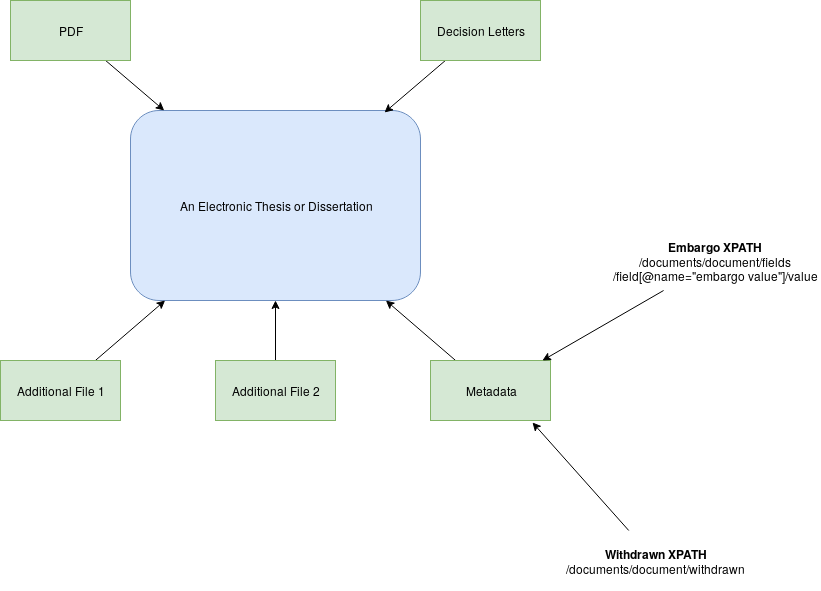
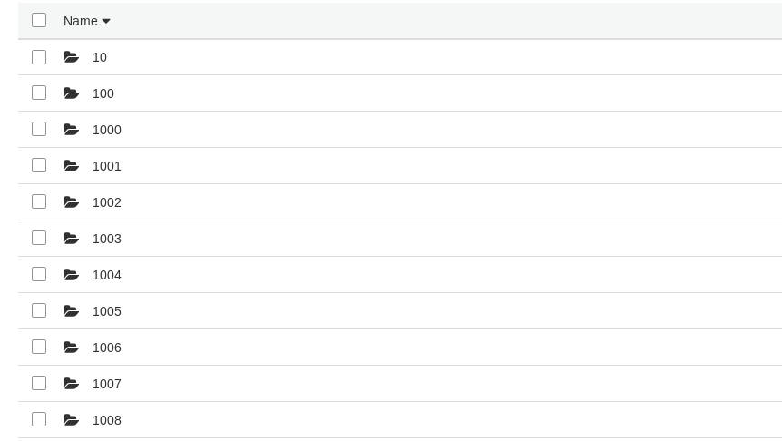
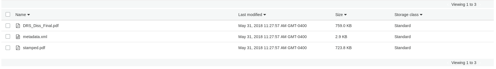
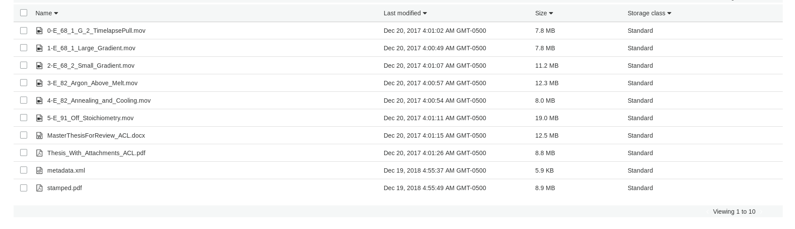

==================================
Electronic Thesis and Dissertation
==================================

-----
About
-----

This document describes the pieces of ETDs that are pertinent for migration from Digital Commons. The document attempts
to illustrate everything we have and be flexible for how we approach migration.

All ETDs are available in one of two directories:  utk_graddiss or utkgradthes. Like other series in Digital Commons,
ETD objects are contained in individual directories with starting with a number.

-------
The PDF
-------

Each ETD has two PDFS:  one with the original Filename from the user and one with the word stamped.

For our purposes, the PDF marked stamped is important because only it has the decision letter from the graduate school.
Also, it has a cover letter generated by Digital Commons that may need to be removed.

--------
Metadata
--------

Digital Commons has its own custom metadata schema and we can provide a copy of it or an in house, MODS generated
version of the file.

MODS
====

.. code-block:: xml

    <mods:mods xmlns:xsi="http://www.w3.org/2001/XMLSchema-instance" xmlns:etd="http://www.ndltd.org/standards/etdms/1.1" xmlns:xlink="http://www.w3.org/1999/xlink" xmlns:mods="http://www.loc.gov/mods/v3" xmlns="http://www.loc.gov/mods/v3" version="3.5" xsi:schemaLocation="http://www.loc.gov/mods/v3 http://www.loc.gov/standards/mods/v3/mods-3-5.xsd">
      <mods:identifier type="local">utk_gradthes/2732</mods:identifier>
      <mods:name>
        <mods:namePart type="family">Lindsey</mods:namePart>
        <mods:namePart type="given">Adam Coleman</mods:namePart>
        <mods:role>
          <mods:roleTerm authority="marcrelator" valueURI="http://id.loc.gov/vocabulary/relators/aut">Author</mods:roleTerm>
        </mods:role>
      </mods:name>
      <mods:name>
        <mods:displayForm>Mariya Zhuravleva</mods:displayForm>
        <mods:role>
          <mods:roleTerm type="text" authority="marcrelator" valueURI="http://id.loc.gov/vocabulary/relators/ths">Thesis advisor</mods:roleTerm>
        </mods:role>
      </mods:name>
      <mods:name>
        <mods:displayForm>Charles L. Melcher</mods:displayForm>
        <mods:role>
          <mods:roleTerm authority="local">Committee member</mods:roleTerm>
        </mods:role>
      </mods:name>
      <mods:name>
        <mods:displayForm> Frederico Harte</mods:displayForm>
        <mods:role>
          <mods:roleTerm authority="local">Committee member</mods:roleTerm>
        </mods:role>
      </mods:name>
      <mods:name>
        <mods:displayForm> Svetlana Zivanovic</mods:displayForm>
        <mods:role>
          <mods:roleTerm authority="local">Committee member</mods:roleTerm>
        </mods:role>
      </mods:name>
      <mods:name>
        <mods:displayForm> Bin Zhao</mods:displayForm>
        <mods:role>
          <mods:roleTerm authority="local">Committee member</mods:roleTerm>
        </mods:role>
      </mods:name>
      <mods:titleInfo>
        <mods:title>The Crystal Growth of Cesium Cerium Chloride Scintillator for X-Ray and Gamma-Ray Spectroscopy Applications</mods:title>
      </mods:titleInfo>
      <mods:subject>
        <mods:topic>Semiconductor and Optical Materials</mods:topic>
      </mods:subject>
      <mods:abstract>&lt;p&gt;&lt;a href="http://foo.bar/baz"&gt;http://foo.bar/baz&lt;/a&gt;The detection and identification of sources of nuclear radiation is an integral tool in defending our nation from threats of nuclear terrorism as well as enforcement of nuclear non-proliferation agreements around the globe. To improve the capabilities in this application, new detection materials surpassing the performance of existing technology utilizing sodium iodide [NaI:Tl] scintillator crystals must be developed and their production cost lowered to meet the demand for the large volumes required. A recently discovered intrinsic scintillation material in the form of crystalline cesium cerium chloride (CsCe&lt;sub&gt;2&lt;/sub&gt;Cl&lt;sub&gt;7&lt;/sub&gt;) has demonstrated promising performance in the detection of X-ray and gamma ray radiation. In order to assess the potential of this material to be developed into larger scale growth of crystals greater than one cubic inch in volume, research into optimizing the growth processes at smaller volumes is necessary.&lt;/p&gt;
    &lt;p&gt;Single crystalline boules of CsCe&lt;sub&gt;2&lt;/sub&gt;Cl&lt;sub&gt;7&lt;/sub&gt; were grown from the melt in sealed fused silica ampoules using the Bridgman method of crystal growth. A transparent growth furnace along with continuous observation apparatus were developed to aid in the investigation of the growth processes. A comparison of growth and cracking behavior under varied conditions was produced and growth protocols identified which improve crystal boule quality. Crystal quality benefits from controlling the self-seeding process through manipulation and control of critical freezing point isotherms during growth. Cracking appears to originate from aggressive detachment of the crystal from the fused silica ampoule wall while inclusions formed during growth by constitutional supercooling of the melt introduce additional crack nucleation sites through action as stress intensifiers within the bulk matrix. Reducing ampoule volume has a minor effect on cracking severity while additions of excess cesium chloride to the initial mixture produce a greater reduction in cracking. The anisotropic coefficients of thermal expansion as well as the refined crystal structure of cesium cerium chloride have been determined through single crystal Laue and temperature dependent powder X-ray diffraction pattern analyses respectively.&lt;/p&gt;</mods:abstract>
      <mods:typeOfResource>text</mods:typeOfResource>
      <mods:originInfo>
        <mods:dateCreated encoding="w3cdtf">2014-03-03T14:31:16-08:00</mods:dateCreated>
        <mods:dateIssued keyDate="yes" encoding="edtf">2014-05</mods:dateIssued>
      </mods:originInfo>
      <mods:extension>
        <etd:degree>
          <etd:name>Master of Science</etd:name>
          <etd:discipline>Materials Science and Engineering</etd:discipline>
          <etd:grantor>University of Tennessee</etd:grantor>
        </etd:degree>
      </mods:extension>
      <mods:genre authority="lcgft" valueURI="http://id.loc.gov/authorities/genreForms/gf2014026039">Academic theses</mods:genre>
      <mods:genre authority="coar" valueURI="http://purl.org/coar/resource_type/c_bdcc">masters thesis</mods:genre>
      <mods:note displayLabel="Keywords submitted by author">Scintillator, Metal Halide, CsCe2Cl7, crystal growth, bridgman method</mods:note>
      <mods:accessCondition type="restriction on access">Restricted: cannot be viewed until 2019-01-01</mods:accessCondition>
      <mods:relatedItem type="series">
        <mods:titleInfo lang="eng">
          <mods:title>Graduate Theses and Dissertations</mods:title>
        </mods:titleInfo>
      </mods:relatedItem>
      <mods:relatedItem type="constituent">
        <mods:titleInfo>
          <mods:title>E_82_Argon_Above_Melt.mov</mods:title>
        </mods:titleInfo>
        <mods:physicalDescription>
          <mods:internetMediaType>video/quicktime</mods:internetMediaType>
        </mods:physicalDescription>
        <mods:note displayLabel="supplemental_file">SUPPL_1</mods:note>
      </mods:relatedItem>
      <mods:relatedItem type="constituent">
        <mods:titleInfo>
          <mods:title>E_82_Annealing_and_Cooling.mov</mods:title>
        </mods:titleInfo>
        <mods:physicalDescription>
          <mods:internetMediaType>video/quicktime</mods:internetMediaType>
        </mods:physicalDescription>
        <mods:note displayLabel="supplemental_file">SUPPL_2</mods:note>
      </mods:relatedItem>
      <mods:relatedItem type="constituent">
        <mods:titleInfo>
          <mods:title>E_68_1_G_2_TimelapsePull.mov</mods:title>
        </mods:titleInfo>
        <mods:physicalDescription>
          <mods:internetMediaType>video/quicktime</mods:internetMediaType>
        </mods:physicalDescription>
        <mods:note displayLabel="supplemental_file">SUPPL_3</mods:note>
      </mods:relatedItem>
      <mods:relatedItem type="constituent">
        <mods:titleInfo>
          <mods:title>E_91_Off_Stoichiometry.mov</mods:title>
        </mods:titleInfo>
        <mods:physicalDescription>
          <mods:internetMediaType>video/quicktime</mods:internetMediaType>
        </mods:physicalDescription>
        <mods:note displayLabel="supplemental_file">SUPPL_4</mods:note>
      </mods:relatedItem>
      <mods:relatedItem type="constituent">
        <mods:titleInfo>
          <mods:title>E_68_2_Small_Gradient.mov</mods:title>
        </mods:titleInfo>
        <mods:physicalDescription>
          <mods:internetMediaType>video/quicktime</mods:internetMediaType>
        </mods:physicalDescription>
        <mods:note displayLabel="supplemental_file">SUPPL_5</mods:note>
      </mods:relatedItem>
      <mods:relatedItem type="constituent">
        <mods:titleInfo>
          <mods:title>E_68_1_Large_Gradient.mov</mods:title>
        </mods:titleInfo>
        <mods:physicalDescription>
          <mods:internetMediaType>video/quicktime</mods:internetMediaType>
        </mods:physicalDescription>
        <mods:note displayLabel="supplemental_file">SUPPL_6</mods:note>
      </mods:relatedItem>
      <mods:recordInfo displayLabel="Submission">
        <mods:recordCreationDate encoding="w3cdtf">2014-03-03T14:31:16-08:00</mods:recordCreationDate>
        <mods:recordContentSource>University of Tennessee, Knoxville Libraries</mods:recordContentSource>
        <mods:recordOrigin>Converted from bepress XML to MODS in general compliance to the MODS Guidelines (Version 3.5).</mods:recordOrigin>
        <mods:recordChangeDate encoding="w3cdtf">2018-03-12T13:13:43-04:00</mods:recordChangeDate>
      </mods:recordInfo>
    </mods:mods>

Digital Commons XML
===================

.. code-block:: xml

    <?xml version='1.0' encoding='UTF-8' ?>
    <documents><document>
    <title>The Crystal Growth of Cesium Cerium Chloride Scintillator for X-Ray and Gamma-Ray Spectroscopy Applications</title>
    <publication-date>2014-05-01T00:00:00-07:00</publication-date>
    <authors>
    <author>
    <email>alindse9@utk.edu</email>
    <institution>University of Tennessee - Knoxville</institution>
    <lname>Lindsey</lname>
    <fname>Adam</fname>
    <mname>Coleman</mname>
    </author>
    </authors>
    <keywords>
    <keyword>Scintillator</keyword>
    <keyword>Metal Halide</keyword>
    <keyword>CsCe2Cl7</keyword>
    <keyword>crystal growth</keyword>
    <keyword>bridgman method</keyword>
    </keywords>
    <disciplines><discipline>Semiconductor and Optical Materials</discipline>
    </disciplines><abstract>&lt;p&gt;&lt;a href="http://foo.bar/baz"&gt;http://foo.bar/baz&lt;/a&gt;The detection and identification of sources of nuclear radiation is an integral tool in defending our nation from threats of nuclear terrorism as well as enforcement of nuclear non-proliferation agreements around the globe. To improve the capabilities in this application, new detection materials surpassing the performance of existing technology utilizing sodium iodide [NaI:Tl] scintillator crystals must be developed and their production cost lowered to meet the demand for the large volumes required. A recently discovered intrinsic scintillation material in the form of crystalline cesium cerium chloride (CsCe&lt;sub&gt;2&lt;/sub&gt;Cl&lt;sub&gt;7&lt;/sub&gt;) has demonstrated promising performance in the detection of X-ray and gamma ray radiation. In order to assess the potential of this material to be developed into larger scale growth of crystals greater than one cubic inch in volume, research into optimizing the growth processes at smaller volumes is necessary.&lt;/p&gt;
    &lt;p&gt;Single crystalline boules of CsCe&lt;sub&gt;2&lt;/sub&gt;Cl&lt;sub&gt;7&lt;/sub&gt; were grown from the melt in sealed fused silica ampoules using the Bridgman method of crystal growth. A transparent growth furnace along with continuous observation apparatus were developed to aid in the investigation of the growth processes. A comparison of growth and cracking behavior under varied conditions was produced and growth protocols identified which improve crystal boule quality. Crystal quality benefits from controlling the self-seeding process through manipulation and control of critical freezing point isotherms during growth. Cracking appears to originate from aggressive detachment of the crystal from the fused silica ampoule wall while inclusions formed during growth by constitutional supercooling of the melt introduce additional crack nucleation sites through action as stress intensifiers within the bulk matrix. Reducing ampoule volume has a minor effect on cracking severity while additions of excess cesium chloride to the initial mixture produce a greater reduction in cracking. The anisotropic coefficients of thermal expansion as well as the refined crystal structure of cesium cerium chloride have been determined through single crystal Laue and temperature dependent powder X-ray diffraction pattern analyses respectively.&lt;/p&gt;</abstract>
    <coverpage-url>http://trace.tennessee.edu/utk_gradthes/2732</coverpage-url>
    <fulltext-url>http://trace.tennessee.edu/cgi/viewcontent.cgi?article=4028&amp;amp;context=utk_gradthes&amp;amp;unstamped=1</fulltext-url>
    <label>2732</label>
    <document-type>thesis</document-type>
    <type>article</type>
    <articleid>4028</articleid>
    <submission-date>2014-03-03T14:31:16-08:00</submission-date>
    <native-url>http://trace.tennessee.edu/context/utk_gradthes/article/4028/type/native/viewcontent</native-url>
    <publication-title>Masters Theses</publication-title>
    <context-key>5257305</context-key>
    <submission-path>utk_gradthes/2732</submission-path>
    <fields>
    <field name="advisor1" type="string">
    <value>Mariya Zhuravleva</value>
    </field>
    <field name="advisor2" type="string" list="true">
    <value>Charles L. Melcher, Frederico Harte, Svetlana Zivanovic, Bin Zhao</value>
    </field>
    <field name="degree_name" type="string">
    <value>Master of Science</value>
    </field>
    <field name="department" type="string">
    <value>Materials Science and Engineering</value>
    </field>
    <field name="embargo_date" type="date">
    <value>2019-01-01T00:00:00-08:00</value>
    </field>
    <field name="instruct" type="string">
    <value>1</value>
    </field>
    <field name="publication_date" type="date">
    <value>2014-05-01T00:00:00-07:00</value>
    </field>
    </fields>
    <supplemental-files>
    <file>
    <archive-name>E_68_1_Large_Gradient.mov</archive-name>
    <upload-name>E_68_1_Large_Gradient.mov</upload-name>
    <url>http://trace.tennessee.edu/cgi/viewcontent.cgi?filename=1&amp;amp;article=4028&amp;amp;context=utk_gradthes&amp;amp;type=additional</url>
    <mime-type>video/quicktime</mime-type>
    </file>
    <file>
    <archive-name>E_68_2_Small_Gradient.mov</archive-name>
    <upload-name>E_68_2_Small_Gradient.mov</upload-name>
    <url>http://trace.tennessee.edu/cgi/viewcontent.cgi?filename=2&amp;amp;article=4028&amp;amp;context=utk_gradthes&amp;amp;type=additional</url>
    <mime-type>video/quicktime</mime-type>
    </file>
    <file>
    <archive-name>E_82_Argon_Above_Melt.mov</archive-name>
    <upload-name>E_82_Argon_Above_Melt.mov</upload-name>
    <url>http://trace.tennessee.edu/cgi/viewcontent.cgi?filename=3&amp;amp;article=4028&amp;amp;context=utk_gradthes&amp;amp;type=additional</url>
    <mime-type>video/quicktime</mime-type>
    </file>
    <file>
    <archive-name>E_82_Annealing_and_Cooling.mov</archive-name>
    <upload-name>E_82_Annealing_and_Cooling.mov</upload-name>
    <url>http://trace.tennessee.edu/cgi/viewcontent.cgi?filename=4&amp;amp;article=4028&amp;amp;context=utk_gradthes&amp;amp;type=additional</url>
    <mime-type>video/quicktime</mime-type>
    </file>
    <file>
    <archive-name>E_91_Off_Stoichiometry.mov</archive-name>
    <upload-name>E_91_Off_Stoichiometry.mov</upload-name>
    <url>http://trace.tennessee.edu/cgi/viewcontent.cgi?filename=5&amp;amp;article=4028&amp;amp;context=utk_gradthes&amp;amp;type=additional</url>
    <mime-type>video/quicktime</mime-type>
    </file>
    </supplemental-files>
    </document>
    </documents>

--------------------------------------------------------
Decision Letters and Correspondence from Graduate School
--------------------------------------------------------

Digital Commons does not provide us with correspondence from the Graduate School, but we have created a tool to scrape
this data from Digital Commons and make it available with the object.

.. code-block:: text

     Date: Mon Nov 22 2010
    Subject: No message sent
    From: Graduate School
    Decision: Accept Dissertation

    -----------------------------------------------------------------------------------------------------------------------

    Date: Tue Nov 16 2010
    Subject: Revise and resubmit: Tantalum Carbene and Imide Complexes. Synthesis, Characterization, and Pathways of Formation
    From: Graduate School
    Decision: Major revisions required for acceptance

    Hi Julia,

    I have reviewed your dissertation for formatting. This email contains three sections: 1) Formatting review; 2) Trace resubmission instructions, and 3) Graduation information. All of this should be considered important information.
    ***********************************************
    1) Formatting review:

    Please make the following changes:

    BLANK PAGES
    There should not be any blank pages in the final version of your dissertation.

    ABSTRACT
    Your abstract should be 350 words or fewer. I would also caution against using sub or superscript letters in the abstract, if possible.

    ***********************************************
    2) Trace resubmission instructions:
    In order to submit a new version, please go to your My
    Account page
    (http://trace.tennessee.edu/cgi/myaccount.cgi).
    On the My Account page, click the title of this article,
    then click the 'revise submission' link on the resulting
    article preview page. Use the Revise Submission form to
    upload any changes to your dissertation.

    The final version will need to be uploaded as a PDF. Do not rely on the Trace conversion
    application, as that doesn't do the best job.
    ***********************************************
    3) Graduation information

    If you are trying to meet the fall deadline, I will need by November 19:

    1. The final version of your dissertation reviewed again and uploaded to Trace in PDF format. Please let me know when you have uploaded this version. Make sure you have looked over the PDF and corrected any changes and removed any content or markings that are not intended to be in the final version. You will not be able to make changes after you submit the final version. Please name your final version LastnameFirstname December2010dissertation.pdf

    2. Your signed approval sheet, turned in to me. (Note that this is different from the Pass/Fail form that your graduation specialist should have sent to your committee chair.)

    The signed version of the approval sheet can either be:

    •	hand-delivered to me --  I am the only person in the office who can take it, so if you choose this option, I would email or call ahead before you or the person you entrust this task to come over; or,

    •	sent via UPS, USPS, or FedEx (FedEx and UPS being preferred over USPS, as FedEx and UPS will deliver straight to our office and not to the central campus mail station.) NOTE: The deadline is not a “postmarked by” date and the approval sheet has to reach me by 5 PM on that deadline. It is your responsibility to get this approval sheet in.

    3. For you to take the Survey of Earned Doctorates (http://web.utk.edu/~thesis/sed.shtml) and send me the certificate of completion as confirmation.

    If you have any questions, please email me at
    thesis@utk.edu.

    Thanks,

    Kris Bronstad
    Thesis/Dissertation Consultant
    The Graduate School
    111 Student Services Bldg
    1331 Circle Park
    Knoxville, TN 37996-0211
    865-974-1337
    thesis@utk.edu
    http://web.utk.edu/~thesis

    © 2019 The Berkeley Electronic Press

    -----------------------------------------------------------------------------------------------------------------------

     Date: Fri Jul 30 2010
    Subject: Revise and resubmit: TANTULUM CARBENE AND IMIDE COMPLEXES. CHARACTERIZATION AND FORMATION PATHWAYS.
    From: Graduate School
    Decision: Major revisions required for acceptance

    Hi Julia,

    I have reviewed your dissertation for formatting. This email contains three sections: 1) Formatting review; 2) Trace resubmission instructions, and 3) Graduation information. All of this should be considered important information.
    ***********************************************
    1) Formatting review:

    Please make the following changes:

    Obviously you will need to fix the table of contents and lists of tables and figures before you tun in the final version.

    The page numbering starts over with page 1 of chapter 1.

     If you are placing a table or figure on a page with non-caption text in the body of your paper, text must cover at least half the page; the table or figure may not cover more than half the page below or above the text, including the title and at least a half inch space. See page 91.

    ***********************************************
    2) Trace resubmission instructions:
    In order to submit a new version, please go to your My
    Account page
    (http://trace.tennessee.edu/cgi/myaccount.cgi).
    On the My Account page, click the title of this article,
    then click the 'revise submission' link on the resulting
    article preview page. Use the Revise Submission form to
    upload any changes to your dissertation.

    The final version will need to be uploaded as a PDF. Do not rely on the Trace conversion
    application, as that doesn't do the best job.
    ***********************************************
    3) Graduation information

    If you are graduating this summer, I will need by August 6th:

    1. The final version of your dissertation reviewed again and uploaded to Trace in PDF format. Please let me know when you have uploaded this version. Make sure you have looked over the PDF and corrected any changes and removed any content or markings that are not intended to be in the final version. You will not be able to make changes after you submit the final version. Please name your final version LastnameFirstname August2010dissertation.pdf

    2. Your signed approval sheet, turned in to me. (Note that this is different from the Pass/Fail form that your graduation specialist should have sent to your committee chair.)

    The signed version of the approval sheet can either be:

    •	hand-delivered to me --  I am the only person in the office who can take it, so if you choose this option, I would email or call ahead before you or the person you entrust this task to come over; or,

    •	sent via UPS, USPS, or FedEx (FedEx and UPS being preferred over USPS, as FedEx and UPS will deliver straight to our office and not to the central campus mail station.) NOTE: The deadline is not a “postmarked by” date and the approval sheet has to reach me by 5 PM on that deadline. It is your responsibility to get this approval sheet in.

    3. For you to take the Survey of Earned Doctorates (http://web.utk.edu/~thesis/sed.shtml) and send me the certificate of completion as confirmation.

    If you have any questions, please email me at
    thesis@utk.edu.

    Thanks,

    Kris Bronstad
    Thesis/Dissertation Consultant
    The Graduate School
    111 Student Services Bldg
    1331 Circle Park
    Knoxville, TN 37996-0211
    865-974-1337
    thesis@utk.edu
    http://web.utk.edu/~thesis

------------------
Additional File(s)
------------------

Some ETDs may have associated files. We assume that any withdrawn or embargo restrictions would apply to all parts of an
ETD including its parts.

----------------
Withdrawn Status
----------------

If an ETD that was published had to be taken down for any reason, a unique XPATH is added to the descriptive metadata
signifying the object was withdrawn from the system on a given date.  While the date is not important to us, the fact
that the object should be restricted from all users besides admins is.  These objects should be migrated but should not
be public in the system.  The withdrawn status can be found at /documents/document/withdrawn.

.. code-block:: xml
    :emphasize-lines: 26

    <?xml version='1.0' encoding='iso-8859-1' ?>
    <documents><document>
    <title>Modeling of Unreinforced Construction Joints in Plain Concrete Using GT STRUDL</title>
    <publication-date>2005-05-01T00:00:00-07:00</publication-date>
    <authors>
    <author>
    <institution>University of Tennessee - Knoxville</institution>
    <lname>Carroll</lname>
    <fname>James</fname>
    <mname>Christopher</mname>
    </author>
    </authors>
    <disciplines><discipline>Civil Engineering</discipline>
    </disciplines><abstract>&lt;p&gt;The purpose of this study was to develop a method to predict the behavior of unreinforced concrete construction joints using the computer program GT STRUDL. Two three-dimensional finite element models of a navigation lock wall were constructed. The wall was subjected to eccentric prestress forces, which brought about concern for lift-off within the lock wall.&lt;/p&gt;
    &lt;p&gt;Eleven loading combinations were evaluated, which were created from seven independent loading conditions. Stresses for each loading combination were compared to nominal strength values as detennined by ACI 318-02, Chapter 22, for plain concrete. Results show the stresses to be acceptable throughout the wall and displacements to be negligible; thus, the structural integrity of the lock wall is adequate for continued operation.&lt;/p&gt;
    &lt;p&gt;A detailed description of the study including the computer modeling, results, and recommendations are discussed in this thesis.&lt;/p&gt;</abstract>
    <coverpage-url>http://trace.tennessee.edu/utk_gradthes/586</coverpage-url>
    <fulltext-url>http://trace.tennessee.edu/cgi/viewcontent.cgi?article=1734&amp;amp;context=utk_gradthes&amp;amp;unstamped=1</fulltext-url>
    <label>586</label>
    <document-type>thesis</document-type>
    <type>article</type>
    <articleid>1734</articleid>
    <submission-date>2010-06-03T09:29:55-07:00</submission-date>
    <publication-title>Masters Theses</publication-title>
    <context-key>1342358</context-key>
    <withdrawn>2011-06-02</withdrawn>
    <submission-path>utk_gradthes/586</submission-path>
    <fields>
    <field name="advisor1" type="string">
    <value>Edwin G. Burdette</value>
    </field>
    <field name="advisor2" type="string" list="true">
    <value>Richard M. Bennett</value>
    <value>J. Hal Deatherage</value>
    </field>
    <field name="degree_name" type="string">
    <value>Master of Science</value>
    </field>
    <field name="department" type="string">
    <value>Civil Engineering</value>
    </field>
    <field name="embargo_date" type="date">
    <value>2010-06-03T00:00:00-07:00</value>
    </field>
    <field name="publication_date" type="date">
    <value>2005-05-01T00:00:00-07:00</value>
    </field>
    </fields>
    </document>
    </documents>

---------------
Embargoed XPATH
---------------

Since the embargo of an ETD can be extended at any time at the request of the author, the embargo is managed in Digital
Commons after it is initially published.  The embargo (if one exists) is available in Digital Commons in the metadata at
/documents/document/fields/field[@name="embargo date"]/value.

.. code-block:: xml
    :emphasize-lines: 50-52

    <?xml version='1.0' encoding='iso-8859-1' ?>
    <documents><document>
    <title>Live Ghosts</title>
    <publication-date>2010-05-01T00:00:00-07:00</publication-date>
    <authors>
    <author>
    <email>pireland@utk.edu</email>
    <institution>University of Tennessee - Knoxville</institution>
    <lname>Ireland</lname>
    <fname>Patricia</fname>
    <mname>Anne</mname>
    </author>
    </authors>
    <keywords>
    <keyword>Creative writing</keyword>
    <keyword>Southern</keyword>
    <keyword>Patty Ireland</keyword>
    <keyword>Knoxville TN</keyword>
    <keyword>Master&#39;s thesis</keyword>
    <keyword>Short stories</keyword>
    </keywords>
    <disciplines><discipline>Arts and Humanities</discipline>
    <discipline>English Language and Literature</discipline>
    </disciplines><abstract>&lt;p&gt;In Live Ghosts, Patricia (Patty) Ireland offers a gathering of short stories based upon real life characters she encountered while growing up in the South. Exploring the diversity, complexity and moral ambiguity of those we might normally perceive as being stereotypically “Southern,” Ireland’s tales encompass a variety of time periods, settings, and characters, including: a modern-day family struggling to reconcile the reality of death, interracial lovers in the early 1950’s who are descended from masters and slaves, and an insane killer locked for life in a mental institution of the 1990’s. Live Ghosts is infused with tales of fear, love, loss, regret, madness, and self discovery, themes intrinsic not only to Southern culture, but to the universal vulnerability in all of us.&lt;/p&gt;</abstract>
    <coverpage-url>http://trace.tennessee.edu/utk_gradthes/634</coverpage-url>
    <fulltext-url>http://trace.tennessee.edu/cgi/viewcontent.cgi?article=1631&amp;amp;context=utk_gradthes&amp;amp;unstamped=1</fulltext-url>
    <label>634</label>
    <document-type>thesis</document-type>
    <type>article</type>
    <articleid>1631</articleid>
    <submission-date>2010-04-02T13:02:57-07:00</submission-date>
    <native-url>http://trace.tennessee.edu/context/utk_gradthes/article/1631/type/native/viewcontent</native-url>
    <publication-title>Masters Theses</publication-title>
    <context-key>1260069</context-key>
    <submission-path>utk_gradthes/634</submission-path>
    <fields>
    <field name="advisor1" type="string">
    <value>Michael Knight</value>
    </field>
    <field name="advisor2" type="string" list="true">
    <value>Marilyn Kallet</value>
    <value>Allen Wier</value>
    </field>
    <field name="degree_name" type="string">
    <value>Master of Arts</value>
    </field>
    <field name="department" type="string">
    <value>English</value>
    </field>
    <field name="embargo_date" type="date">
    <value>2019-12-01T00:00:00-08:00</value>
    </field>
    <field name="publication_date" type="date">
    <value>2010-05-01T00:00:00-07:00</value>
    </field>
    </fields>
    </document>
    </documents>
