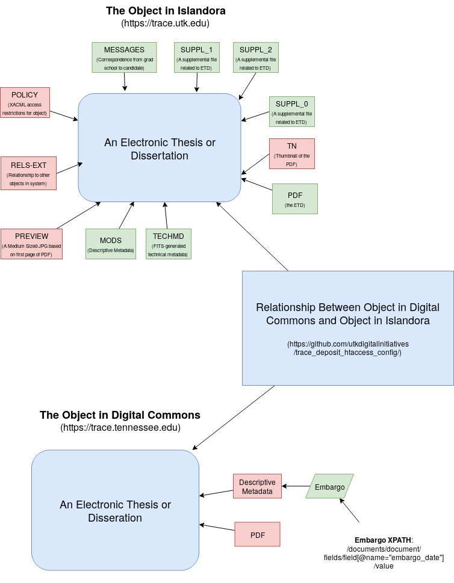

=================================
ETD that started in Trace Deposit
=================================

-----
About
-----

Beginning in December 2017, ETDs were approved by the graduate school in `Trace Deposit <https://trace.utk.edu>`_.
The ETDs here were approved in this system and later migrated to our `production Trace instance <https://trace.tennesse.edu>`_.
Because of this, these objects have a complicated model where pertinent parts of the ETD are maintained in two
systems.  This document describes this in great detail with emphasis on what's important, why, and how to relate the
objects in each system.

----------
Data Model
----------

