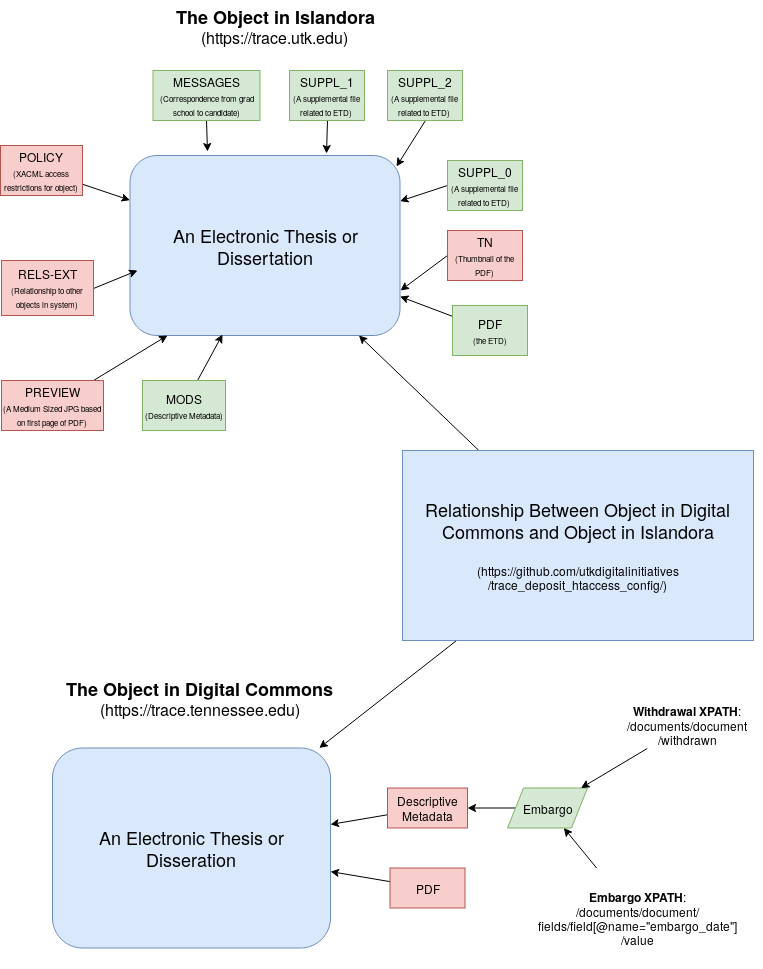

=================================
ETD that started in Trace Deposit
=================================

-----
About
-----

Beginning in December 2017, ETDs were approved by the graduate school in `Trace Deposit <https://trace.utk.edu>`_.
The ETDs here were approved in this system and later migrated to our `production Trace instance <https://trace.tennesse.edu>`_.
Because of this, these objects have a complicated model where pertinent parts of the ETD are maintained in two
systems.  This document describes this in great detail with emphasis on what's important, why, and how to relate the
objects in each system.

----------
Data Model
----------

ETDs that started in Trace Deposit have pieces that are pertinent to the migration in 3 separate systems:

* `Trace Deposit <https://trace.utk.edu>`_
* `Trace <https://trace.tennesse.edu>`_
* `GitHub <https://github.com/utkdigitalinitiatives/trace_deposit_htaccess_config>`_

The objects in each system are represented by the objects in blue above.  The bitstreams that are pertinent to the
migration are displayed in green.

A description of the overall object in each system is detailed in the following sections.

-----------------------------------------------
GitHub Relationships and Redirection Repository
-----------------------------------------------

An ETD in Trace is maintained in more than one system.  This is due to our `public interace system <https://trace.teneessee.edu>`_
being unable to support all parts of an originating ETD.  Because of this, a `GitHub repository <https://github.com/utkdigitalinitiatives/trace_deposit_htaccess_config>`_
is maintained that shows the relationship between the object in `Digital Commons <https://trace.tennessee.edu>`_  and
`Islandora <https://trace.utk.edu>`_.

The key piece of the repo is a file called `migrated_etds.config <https://github.com/utkdigitalinitiatives/trace_deposit_htaccess_config/blob/master/migrated_etds.config>`_.
This file is an Apache config file that lives in `Trace Deposit <https://trace.utk.edu>` and redirects access to the
object to the same object in digital commons.  Because of this, the path listed directly after Redirect 301 implies that
https://trace.utk.edu/ should be prepended to the address.

Here is a sample set of redirected objects between the two systems:

.. code-block:: text

    Redirect 301 /islandora/object/utk.ir.td:133 http://trace.tennessee.edu/utk_gradthes/4983
    Redirect 301 /islandora/object/utk.ir.td:283 http://trace.tennessee.edu/utk_gradthes/4984
    Redirect 301 /islandora/object/utk.ir.td:299 http://trace.tennessee.edu/utk_gradthes/4985
    Redirect 301 /islandora/object/utk.ir.td:417 http://trace.tennessee.edu/utk_gradthes/4986
    Redirect 301 /islandora/object/utk.ir.td:419 http://trace.tennessee.edu/utk_gradthes/4987
    Redirect 301 /islandora/object/utk.ir.td:104 http://trace.tennessee.edu/utk_gradthes/4988
    Redirect 301 /islandora/object/utk.ir.td:230 http://trace.tennessee.edu/utk_gradthes/4989
    Redirect 301 /islandora/object/utk.ir.td:68 http://trace.tennessee.edu/utk_gradthes/4990
    Redirect 301 /islandora/object/utk.ir.td:139 http://trace.tennessee.edu/utk_gradthes/4991
    Redirect 301 /islandora/object/utk.ir.td:134 https://trace.tennessee.edu/utk_gradthes/4992/

