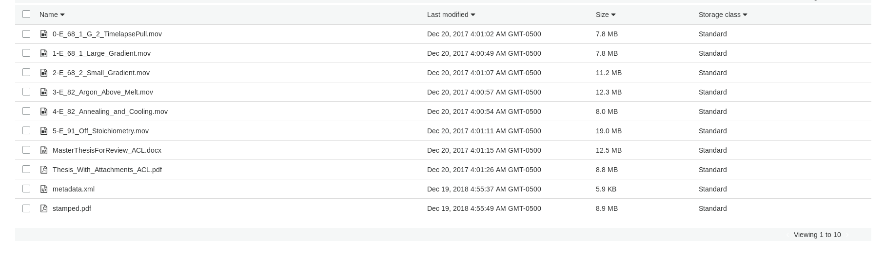

======================
Other Objects in Trace
======================

-----
About
-----

This document attempts to cover other objects in Trace.  These objects can be any binary file type, may have restrictions
like those described in ETDs, and and have many additional files associated with them.

These objects have no structural metadata but are stored in directories with any additional files and their metadata.

A PDF
=====

An Image
========

------------------
Additional File(s)
------------------

Some objects may have associated files. We assume that any withdrawn or embargo restrictions would apply to all parts of an
object including its parts.

----------------
Withdrawn Status
----------------

If an object that was published had to be taken down for any reason, a unique XPATH is added to the descriptive metadata
signifying the object was withdrawn from the system on a given date.  Unless the object is an ETD,
this object is not important for migration and can be dropped. The withdrawn status can be found at /documents/document/withdrawn.

.. code-block:: xml
    :emphasize-lines: 26

    <?xml version='1.0' encoding='iso-8859-1' ?>
    <documents><document>
    <title>Modeling of Unreinforced Construction Joints in Plain Concrete Using GT STRUDL</title>
    <publication-date>2005-05-01T00:00:00-07:00</publication-date>
    <authors>
    <author>
    <institution>University of Tennessee - Knoxville</institution>
    <lname>Carroll</lname>
    <fname>James</fname>
    <mname>Christopher</mname>
    </author>
    </authors>
    <disciplines><discipline>Civil Engineering</discipline>
    </disciplines><abstract>&lt;p&gt;The purpose of this study was to develop a method to predict the behavior of unreinforced concrete construction joints using the computer program GT STRUDL. Two three-dimensional finite element models of a navigation lock wall were constructed. The wall was subjected to eccentric prestress forces, which brought about concern for lift-off within the lock wall.&lt;/p&gt;
    &lt;p&gt;Eleven loading combinations were evaluated, which were created from seven independent loading conditions. Stresses for each loading combination were compared to nominal strength values as detennined by ACI 318-02, Chapter 22, for plain concrete. Results show the stresses to be acceptable throughout the wall and displacements to be negligible; thus, the structural integrity of the lock wall is adequate for continued operation.&lt;/p&gt;
    &lt;p&gt;A detailed description of the study including the computer modeling, results, and recommendations are discussed in this thesis.&lt;/p&gt;</abstract>
    <coverpage-url>http://trace.tennessee.edu/utk_gradthes/586</coverpage-url>
    <fulltext-url>http://trace.tennessee.edu/cgi/viewcontent.cgi?article=1734&amp;amp;context=utk_gradthes&amp;amp;unstamped=1</fulltext-url>
    <label>586</label>
    <document-type>thesis</document-type>
    <type>article</type>
    <articleid>1734</articleid>
    <submission-date>2010-06-03T09:29:55-07:00</submission-date>
    <publication-title>Masters Theses</publication-title>
    <context-key>1342358</context-key>
    <withdrawn>2011-06-02</withdrawn>
    <submission-path>utk_gradthes/586</submission-path>
    <fields>
    <field name="advisor1" type="string">
    <value>Edwin G. Burdette</value>
    </field>
    <field name="advisor2" type="string" list="true">
    <value>Richard M. Bennett</value>
    <value>J. Hal Deatherage</value>
    </field>
    <field name="degree_name" type="string">
    <value>Master of Science</value>
    </field>
    <field name="department" type="string">
    <value>Civil Engineering</value>
    </field>
    <field name="embargo_date" type="date">
    <value>2010-06-03T00:00:00-07:00</value>
    </field>
    <field name="publication_date" type="date">
    <value>2005-05-01T00:00:00-07:00</value>
    </field>
    </fields>
    </document>
    </documents>

---------------
Embargoed XPATH
---------------

If an embargo exists, it will have a special xpath with its release date at:
/documents/document/fields/field[@name="embargo date"]/value.

.. code-block:: xml
    :emphasize-lines: 50-52

    <?xml version='1.0' encoding='iso-8859-1' ?>
    <documents><document>
    <title>Live Ghosts</title>
    <publication-date>2010-05-01T00:00:00-07:00</publication-date>
    <authors>
    <author>
    <email>pireland@utk.edu</email>
    <institution>University of Tennessee - Knoxville</institution>
    <lname>Ireland</lname>
    <fname>Patricia</fname>
    <mname>Anne</mname>
    </author>
    </authors>
    <keywords>
    <keyword>Creative writing</keyword>
    <keyword>Southern</keyword>
    <keyword>Patty Ireland</keyword>
    <keyword>Knoxville TN</keyword>
    <keyword>Master&#39;s thesis</keyword>
    <keyword>Short stories</keyword>
    </keywords>
    <disciplines><discipline>Arts and Humanities</discipline>
    <discipline>English Language and Literature</discipline>
    </disciplines><abstract>&lt;p&gt;In Live Ghosts, Patricia (Patty) Ireland offers a gathering of short stories based upon real life characters she encountered while growing up in the South. Exploring the diversity, complexity and moral ambiguity of those we might normally perceive as being stereotypically “Southern,” Ireland’s tales encompass a variety of time periods, settings, and characters, including: a modern-day family struggling to reconcile the reality of death, interracial lovers in the early 1950’s who are descended from masters and slaves, and an insane killer locked for life in a mental institution of the 1990’s. Live Ghosts is infused with tales of fear, love, loss, regret, madness, and self discovery, themes intrinsic not only to Southern culture, but to the universal vulnerability in all of us.&lt;/p&gt;</abstract>
    <coverpage-url>http://trace.tennessee.edu/utk_gradthes/634</coverpage-url>
    <fulltext-url>http://trace.tennessee.edu/cgi/viewcontent.cgi?article=1631&amp;amp;context=utk_gradthes&amp;amp;unstamped=1</fulltext-url>
    <label>634</label>
    <document-type>thesis</document-type>
    <type>article</type>
    <articleid>1631</articleid>
    <submission-date>2010-04-02T13:02:57-07:00</submission-date>
    <native-url>http://trace.tennessee.edu/context/utk_gradthes/article/1631/type/native/viewcontent</native-url>
    <publication-title>Masters Theses</publication-title>
    <context-key>1260069</context-key>
    <submission-path>utk_gradthes/634</submission-path>
    <fields>
    <field name="advisor1" type="string">
    <value>Michael Knight</value>
    </field>
    <field name="advisor2" type="string" list="true">
    <value>Marilyn Kallet</value>
    <value>Allen Wier</value>
    </field>
    <field name="degree_name" type="string">
    <value>Master of Arts</value>
    </field>
    <field name="department" type="string">
    <value>English</value>
    </field>
    <field name="embargo_date" type="date">
    <value>2019-12-01T00:00:00-08:00</value>
    </field>
    <field name="publication_date" type="date">
    <value>2010-05-01T00:00:00-07:00</value>
    </field>
    </fields>
    </document>
    </documents>

